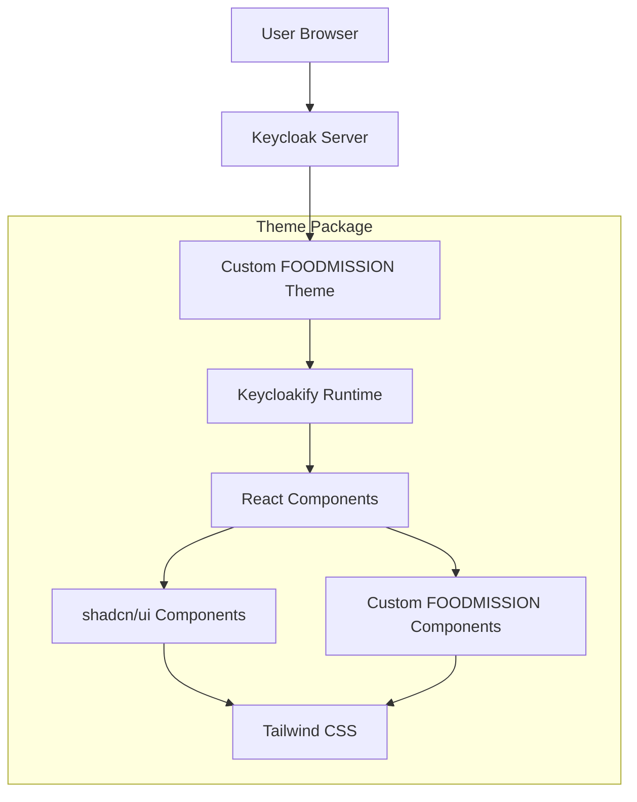

# Design Document

## Overview

This design outlines the implementation of a custom Keycloak theme for the FOODMISSION project using Keycloakify, a React-based framework for creating Keycloak themes. The solution will integrate shadcn/ui components to maintain visual consistency with existing FOODMISSION applications while providing a modern, accessible authentication experience.

## Architecture

### High-Level Architecture



### Technology Stack

- **Keycloakify**: React-based framework for Keycloak theme development
- **React 18**: Component framework for building the UI
- **TypeScript**: Type-safe development
- **shadcn/ui**: UI component library for consistency
- **Tailwind CSS**: Utility-first CSS framework
- **Vite**: Build tool for fast development and optimized production builds
- **Keycloak**: Identity and access management server

## Components and Interfaces

### Core Theme Components

#### 1. Login Page Components

- **LoginForm**: Main authentication form with email/username and password fields
- **LoginHeader**: FOODMISSION branding and project context
- **LoginFooter**: Links to project information and support
- **SocialLoginButtons**: Integration with external identity providers if needed

#### 2. Registration Components

- **RegisterForm**: User registration form with validation
- **TermsAndConditions**: FOODMISSION-specific terms and privacy policy
- **RegistrationSuccess**: Confirmation page with next steps

#### 3. Account Management Components

- **ProfileForm**: User profile editing interface
- **PasswordChangeForm**: Secure password update functionality
- **AccountSettings**: User preferences and account management

#### 4. Error and Info Pages

- **ErrorPage**: Styled error messages with FOODMISSION branding
- **InfoPage**: Information displays for various authentication states
- **MaintenancePage**: System maintenance notifications

### shadcn/ui Integration

#### Component Mapping

- **Input**: Form fields (email, password, text inputs)
- **Button**: Primary and secondary action buttons
- **Card**: Container components for forms and content sections
- **Alert**: Error messages and notifications
- **Label**: Form field labels with proper accessibility
- **Checkbox**: Terms acceptance and remember me functionality
- **Select**: Dropdown menus for language selection or other options

#### Custom Theme Extensions

- **FoodmissionCard**: Branded card component with project styling
- **ProjectHeader**: Header component with FOODMISSION logo and mission statement
- **CitizenScienceCallout**: Information component highlighting the project's purpose

## Data Models

### Theme Configuration

```typescript
interface FoodmissionThemeConfig {
  branding: {
    logoUrl: string;
    primaryColor: string;
    secondaryColor: string;
    projectName: string;
  };
  content: {
    welcomeMessage: string;
    projectDescription: string;
    supportEmail: string;
    privacyPolicyUrl: string;
    termsOfServiceUrl: string;
  };
  features: {
    socialLogin: boolean;
    selfRegistration: boolean;
    passwordReset: boolean;
  };
}
```

### User Context

```typescript
interface UserContext {
  locale: string;
  realm: string;
  client: string;
  redirectUri?: string;
  loginHint?: string;
}
```

## Error Handling

### Error Categories

1. **Authentication Errors**: Invalid credentials, account locked, expired sessions
2. **Validation Errors**: Form field validation, password requirements
3. **Network Errors**: Connection issues, server unavailability
4. **Configuration Errors**: Missing theme assets, invalid configuration

### Error Display Strategy

- Use shadcn/ui Alert components for consistent error presentation
- Provide clear, user-friendly error messages in multiple languages
- Include contextual help and recovery suggestions
- Log technical errors for debugging while showing simplified messages to users

### Error Recovery

- Automatic retry mechanisms for transient network errors
- Clear navigation paths back to working states
- Progressive disclosure of technical details for advanced users
- Integration with Keycloak's built-in error handling

## Testing Strategy

### Unit Testing

- **Component Testing**: Test individual React components with Jest and React Testing Library
- **Theme Logic Testing**: Validate theme configuration and customization logic
- **Accessibility Testing**: Ensure WCAG 2.1 AA compliance using automated tools

### Integration Testing

- **Keycloak Integration**: Test theme deployment and functionality within Keycloak
- **Cross-browser Testing**: Verify compatibility across modern browsers
- **Responsive Design Testing**: Validate mobile and desktop experiences

### End-to-End Testing

- **Authentication Flows**: Complete login, registration, and password reset workflows
- **Multi-language Support**: Test localization and internationalization
- **Error Scenarios**: Validate error handling and recovery paths

### Performance Testing

- **Bundle Size Analysis**: Monitor and optimize theme package size
- **Load Time Testing**: Ensure fast initial page loads
- **Accessibility Performance**: Test with screen readers and assistive technologies

## Development Workflow

### Local Development

1. **Hot Reload Setup**: Configure Vite for rapid development iteration
2. **Mock Keycloak Environment**: Local development server with Keycloak simulation
3. **Component Storybook**: Isolated component development and testing
4. **Design System Integration**: Live preview of shadcn/ui components

### Build Process

1. **TypeScript Compilation**: Type checking and JavaScript generation
2. **CSS Processing**: Tailwind CSS compilation and optimization
3. **Asset Bundling**: Image and font optimization
4. **Theme Packaging**: JAR file generation for Keycloak deployment

### Deployment Pipeline

1. **Automated Testing**: Run full test suite on build
2. **Theme Validation**: Verify Keycloak compatibility
3. **Staging Deployment**: Test in staging environment
4. **Production Release**: Automated deployment to production Keycloak instances

## Security Considerations

### Content Security Policy

- Implement strict CSP headers for theme assets
- Whitelist only necessary external resources
- Prevent XSS attacks through proper content sanitization

### Authentication Security

- Follow Keycloak security best practices
- Implement proper session management
- Ensure secure password handling and validation

### Data Privacy

- Comply with GDPR requirements for EU-funded project
- Implement proper data handling for citizen science context
- Provide clear privacy controls and consent mechanisms
